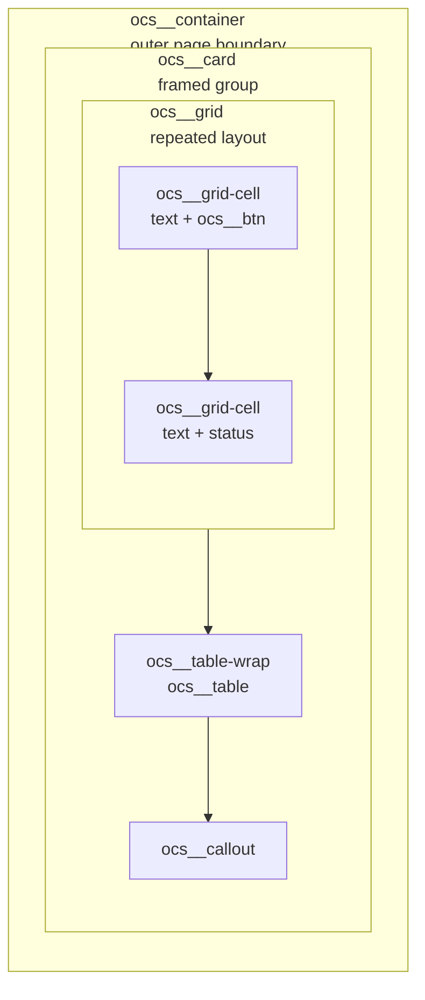

## OCS Container

The OCS Container is a structural wrapper that establishes the page boundary and provides structure for the content in our page.  


### How it Fits



**Key Takeaway**: Containers encompass the entire page, and all other SASS elemenets are "contained" in them.

### Tech Talk

We are using a shared OCS container grammar. This means **you don't need to write CSS for your page layout**. Instead of writing wrapper styles, you just need to put your code within a `ocs_container` block. The global system to take care of the styling.

* **The Rule:** Use one `ocs__container` `<div>` block per page, with children like `ocs__card` and `ocs__grid`. Let the system handle the look.
* ✅ **Do this:** `<div class="ocs__container">` with `<div class="ocs__card">` inside it
* ❌ **Don't do this:** `<div class="page-wrap" style="max-width: 900px; margin: auto;">` or `<div class="pretty-box">`

Why do we do this? It ensures our whole project looks consistent, makes our code reusable, and keeps every page responsive without extra work.

### SASS Code

You can find the OCS SASS Container code in `_sass/open-coding/elements/containers/common.scss` (loaded through `_main.scss` in the same folder):

```scss
// Shared page container for document-style elements.
.ocs__container {
  max-width: 900px;
  margin: 0 auto;
  padding: 2rem 1.5rem;
  font-family: var(--pref-font-family);
  color: var(--pref-text-color);
}

.ocs__container,
.ocs__container * {
  box-sizing: border-box;
}
```

What this code does:

* `max-width: 900px; margin: 0 auto;` — constrains the page to a readable width and centers it, establishing the outer page boundary.
* `padding: 2rem 1.5rem;` — adds breathing room so content never touches the viewport edge.
* `font-family` / `color` — inherit the active user-preference theme tokens, so the container adapts to light/dark/accent choices with no page-specific CSS.
* `box-sizing: border-box;` — applied to the container and all children so padding and borders stay inside the 900px boundary.

### Code Examples

> How you can use OCS containers in your blogs, projects, and hacks.

#### A. Simple: Container and Card

```html
<!-- One container per page. Cards group related content inside it. -->
<div class="ocs__container">
  <h2 class="ocs__section-title">About Our Project</h2>
  <div class="ocs__card">
    <p class="ocs__description">We are a group of CSP students building a cool web app.</p>
  </div>
</div>
```

#### B. Adding a Grid

```html
<!-- Don't invent column classes. Use ocs__grid with ocs__grid-cell children. -->
<div class="ocs__container">
  <div class="ocs__card">
    <h3 class="ocs__section-title">Team Roles</h3>
    <div class="ocs__grid ocs__grid--standard cols-2">
      <div class="ocs__grid-cell">Frontend: builds the pages.</div>
      <div class="ocs__grid-cell">Backend: builds the API.</div>
    </div>
  </div>
</div>
```

#### C. Complex: Full Container Composition

```html
<!-- Compose container > card > grid + table, mirroring the Containers Grammar page -->
<div class="ocs__container">
  <h2 class="ocs__section-title">Hardware Plan</h2>
  <div class="ocs__card">
    <div class="ocs__grid ocs__grid--standard cols-2">
      <div class="ocs__grid-cell ocs__grid-cell--accent">Current hardware</div>
      <div class="ocs__grid-cell">Next hardware</div>
    </div>
    <div class="ocs__table-wrap">
      <table class="ocs__table">
        <tr><th>Item</th><th>Status</th></tr>
        <tr><td>Camera</td><td>Current</td></tr>
      </table>
    </div>
    <div class="ocs__callout">The same structure adapts to the active theme. No page-specific CSS is needed.</div>
  </div>
</div>
```

### Live Example: Container with Standard Grid

Resize the window to see it work. The three cells share the container width and collapse from 3 columns to 2 on mobile. This applies to every container using the same grammar, existing or new, with no custom CSS.

<div class="ocs__container">
  <div class="ocs__card">
    <h3 class="ocs__section-title">Containers Resize With You</h3>
    <p class="ocs__description">A container sets the boundary. The standard grid splits it into columns that stretch and wrap.</p>
    <div class="ocs__grid ocs__grid--standard cols-3">
      <div class="ocs__grid-cell">A  container sets the boundary.</div>
      <div class="ocs__grid-cell">Grids split the container into columns.</div>
      <div class="ocs__grid-cell">Cells stretch and wrap with the container.</div>
    </div>
  </div>
</div>

### What benifit did containers give us?

**Styling all content in a specific section**: OCS containers allow us to style all other OCS SASS elements, such as grids, cards, and grid cells, in one centralized place.

### Hack: Invite Rescue (~10 minutes)

> A 10-minute challenge for someone new to SASS: rescue a broken invite page using only the OCS container grammar. No custom CSS.

**Story:** Rohan's invite sprawls edge-to-edge, uses a purple inline title, and lays out the schedule with a hand-made flex row that breaks on phones. Rebuild it inside one `ocs__container` so it looks consistent and responsive.

**Starter code** — paste into a notebook code cell and run it with `UI_RUNNER`:

```html
%%html

<!-- UI_RUNNER: Containers Hack Base -->

<div class="page-wrap" style="max-width: 1100px; margin: auto;">
  <h1 style="color: purple;">Rohan's Goofing Off Invite</h1>
  <div style="display: flex;">
    <div class="box">Pizza at 6pm</div>
    <div class="box">Demos at 7pm</div>
    <div class="box">Prizes at 8pm</div>
  </div>
</div>
```

**Your tasks:**

* Replace the `page-wrap` div with one `ocs__container` div.
* Wrap the content in an `ocs__card`, with the title as an `ocs__section-title` and a one-line `ocs__description` of your own.
* Replace the inline flex row and `box` divs with an `ocs__grid ocs__grid--standard cols-3` holding three `ocs__grid-cell` divs (one per schedule item, one with `--accent`).
* Remove every inline `style` and made-up class. Run the cell and resize to check it collapses cleanly on mobile.

**Done when:**

* Present: `%%html` and the `UI_RUNNER` comment line.
* Present: one `ocs__container`, one `ocs__card`, one `ocs__grid--standard` with three `ocs__grid-cell` children.
* Absent: inline styles and made-up classes like `page-wrap` or `box`. 
* Test: Demostrate system awareness & Ensure you have tested that the finished product works on phones as well as computers
