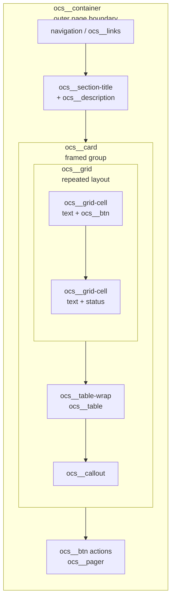

## OCS Container and HTML Semantics

The OCS Container is a structural wrapper that establishes the page boundary and provides structure for the content in our page.  


### How it Fits



**Key Takeaway**: Containers encompass the entire page, and all other SASS elemenets are "contained" in them.

### Tech Talk

We are using a shared OCS container grammar. This means **you don't need to write CSS for your page layout**. Instead of writing wrapper styles, you just need to put your code within a `ocs_container` block. The global system to take care of the styling.

* **The Rule:** Use one `ocs__container` `<div>` block per page, with children like `ocs__card` and `ocs__grid`. Let the system handle the look.
* ✅ **Do this:** `<div class="ocs__container">` with `<div class="ocs__card">` inside it
* ❌ **Don't do this:** `<div class="page-wrap" style="max-width: 900px; margin: auto;">` or `<div class="pretty-box">`

Why do we do this? It ensures our whole project looks consistent, makes our code reusable, and keeps every page responsive without extra work.

### Code Examples

#### A. Simple: Container and Card

```html
<!-- One container per page. Cards group related content inside it. -->
<div class="ocs__container">
  <h2 class="ocs__section-title">About Our Project</h2>
  <div class="ocs__card">
    <p class="ocs__description">We are a group of CSP students building a cool web app.</p>
  </div>
</div>
```

#### B. Adding a Grid

```html
<!-- Don't invent column classes. Use ocs__grid with ocs__grid-cell children. -->
<div class="ocs__container">
  <div class="ocs__card">
    <h3 class="ocs__section-title">Team Roles</h3>
    <div class="ocs__grid ocs__grid--standard cols-2">
      <div class="ocs__grid-cell">Frontend: builds the pages.</div>
      <div class="ocs__grid-cell">Backend: builds the API.</div>
    </div>
  </div>
</div>
```

#### C. Complex: Full Container Composition

```html
<!-- Compose container > card > grid + table, mirroring the Containers Grammar page -->
<div class="ocs__container">
  <h2 class="ocs__section-title">Hardware Plan</h2>
  <div class="ocs__card">
    <div class="ocs__grid ocs__grid--standard cols-2">
      <div class="ocs__grid-cell ocs__grid-cell--accent">Current hardware</div>
      <div class="ocs__grid-cell">Next hardware</div>
    </div>
    <div class="ocs__table-wrap">
      <table class="ocs__table">
        <tr><th>Item</th><th>Status</th></tr>
        <tr><td>Camera</td><td>Current</td></tr>
      </table>
    </div>
    <div class="ocs__callout">The same structure adapts to the active theme. No page-specific CSS is needed.</div>
  </div>
</div>
```

