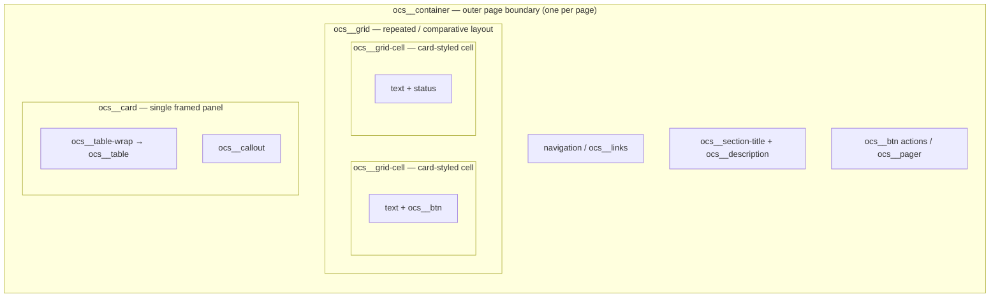

## Main Idea

Use HTML for grouping and OCS classes for reusable container roles. This example shows how OCS classes give plain wrappers a defined page structure.

```html
<div class="ocs__container">
  <h2 class="ocs__section-title">Project Hub</h2>
  <div class="ocs__card">
    <p class="ocs__description">One container holds the page. Cards group related content inside it.</p>
  </div>
</div>
```

### How it Fits

> How do containers fit into an OCS page?



**Key Takeaway**: Containers encompass the entire page or a section, and all other SASS elemenets are "contained" in them.

### OCS Containers Grammar

Use OCS classes to express container roles without hardcoded layout styling.

| Rule | Use |
| --- | --- |
| `ocs__container` | Single page-width wrapper; establishes page boundary and typography |
| `ocs__card` | Framed content panel for a related group inside the container |
| `ocs__grid` | Repeated or comparative layout inside a container or card |
| `ocs__grid-cell` | Single cell inside `ocs__grid` |
| `ocs__section-title` | Section or card heading |
| `ocs__description` | Introductory or supporting description text |
| `ocs__callout` | Highlighted note or takeaway inside a card |
| `ocs__table-wrap` | Scroll-safe wrapper for `ocs__table` comparison data |

---

## 1. LxD Cycle Process

**Empathize:** I noticed a lot of students try to manually build page layout using custom wrapper classes (like `<div class="my-box" style="max-width: 800px; border: 1px solid gray;">Content</div>`) instead of letting the shared OCS container grammar handle it. This breaks visual consistency across pages and creates one-off CSS nobody else can reuse.

**Define:**

* **POV:** CSP students need a way to structure full page sections using shared container classes because relying on custom wrappers and inline styles creates messy code and inconsistent design.
* **Learning Goal:** Students will understand how to compose pages with OCS container grammar by applying `ocs__container`, `ocs__card`, and `ocs__grid` roles instead of custom layout classes.

**Ideate:**

* **HMW Question:** How might we teach students to trust the shared container grammar and stop hardcoding page layout?
* **Activity:** Refactoring a poorly written block of custom wrapper divs into a clean `ocs__container` > `ocs__card` > `ocs__grid` composition that automatically inherits our SASS theme.

**Prototype & Test:** I taught a trial run to my project team. They felt the original homework was too long, so I revised it to be a single, focused refactoring task (documented below).

---

## 2. Lesson Plan

**Learning Objective:** By the end of this lesson, you will be able to compose page sections using OCS container classes so they automatically inherit our global SASS layout styles without using custom wrappers.

**Success Criteria:** You can take an unstyled stack of divs, apply one `ocs__container` with `ocs__card` and `ocs__grid` children, and have it match our site's design system perfectly.

### Tech Talk (3 minutes)

We are using a shared OCS container grammar. This means **you don't need to write CSS for your page layout**. Instead of inventing wrapper styles, you just need to tell the browser *what role* each block plays. There's already a global system to take care of the styling.

* **The Rule:** Use one `ocs__container` per page, with `ocs__card` and `ocs__grid` children. Let the system handle the look.
* ✅ **Do this:** `<div class="ocs__container">` with `<div class="ocs__card">` inside it
* ❌ **Don't do this:** `<div class="page-wrap" style="max-width: 900px; margin: auto;">` or `<div class="pretty-box">`

Why do we do this? It ensures our whole project looks consistent, makes our code reusable, and keeps every page responsive without extra work.

### Code Examples

#### A. Simple: Container and Card

```html
<!-- One container per page. Cards group related content inside it. -->
<div class="ocs__container">
  <h2 class="ocs__section-title">About Our Project</h2>
  <div class="ocs__card">
    <p class="ocs__description">We are a group of CSP students building a cool web app.</p>
  </div>
</div>
```

#### B. Intermediate: Adding a Grid

```html
<!-- Don't invent column classes. Use ocs__grid with ocs__grid-cell children. -->
<div class="ocs__container">
  <div class="ocs__card">
    <h3 class="ocs__section-title">Team Roles</h3>
    <div class="ocs__grid ocs__grid--standard cols-2">
      <div class="ocs__grid-cell">Frontend: builds the pages.</div>
      <div class="ocs__grid-cell">Backend: builds the API.</div>
    </div>
  </div>
</div>
```

#### C. Complex: Full Container Composition

```html
<!-- Compose container > card > grid + table, mirroring the Containers Grammar page -->
<div class="ocs__container">
  <h2 class="ocs__section-title">Hardware Plan</h2>
  <div class="ocs__card">
    <div class="ocs__grid ocs__grid--standard cols-2">
      <div class="ocs__grid-cell ocs__grid-cell--accent">Current hardware</div>
      <div class="ocs__grid-cell">Next hardware</div>
    </div>
    <div class="ocs__table-wrap">
      <table class="ocs__table">
        <tr><th>Item</th><th>Status</th></tr>
        <tr><td>Camera</td><td>Current</td></tr>
      </table>
    </div>
    <div class="ocs__callout">The same structure adapts to the active theme. No page-specific CSS is needed.</div>
  </div>
</div>
```

---

## 3. Hacks & Practice Tasks

### Prepare your submission IPYNB

Complete this quick-start flow so you can begin in about 2 minutes.

1. Create a new notebook in your portfolio homework area: `_notebooks/homework`.
2. Add one markdown cell at the top with the frontmatter below.
3. Add code cells for Popcorn and Homework. Keep the `%%html` and `UI_RUNNER` comment in each code cell.
4. Run each cell and verify the rendered output before submitting.

```raw
---
layout: post
title: OCS SASS Containers Grammar HW
categories: [SASS]
lesson_language: SASS
lesson_topic: Containers HW
lesson_part: interactive
lesson_type: lesson
permalink: /sass/containers-hw
author: githubID
---
```

### Submission Safety Rules (Read First)

> [!IMPORTANT]
> To avoid grading errors, follow these rules exactly:
>
> * Submit only your final container HTML for each hack.
> * Do not add custom CSS, inline styles, or non-OCS layout classes.
> * Keep `%%html` and the `UI_RUNNER` comment line in each submission cell.
> * Use only allowed OCS container classes for this lesson: `ocs__container`, `ocs__card`, `ocs__grid`, `ocs__grid-cell`, `ocs__section-title`, `ocs__description`, `ocs__callout`, `ocs__table-wrap`, `ocs__table`.
> * Use exactly one `ocs__container` as the outer wrapper in each hack.

### Popcorn Hack (In-Class)

> [!TIP]
> 2-minute challenge: refactor and run, then paste only your corrected code in chat.

**Task:** Look at the bad code below. Replace custom wrapper classes with OCS container roles and run it with UI_RUNNER.

```html
%%html

<!-- UI_RUNNER: Containers Popcorn Base-->

<div class="page-wrap">
  <div class="big-heading">Welcome!</div>
  <div class="pretty-box">This content belongs together.</div>
</div>
```

**Expected direction:** one `ocs__container`, one section title, and one `ocs__card` holding the grouped content.

### Homework Hack

**Task:** Refactor the following code block. Remove all custom wrapper classes and inline styles, then rebuild it as an `ocs__container` holding an `ocs__card` with a two-cell `ocs__grid` inside, so it uses our shared container grammar. Run with UI_RUNNER, then submit the clean HTML in your notebook.

```html
%%html

<!-- UI_RUNNER: Containers Homework Base -->
<div class="outer-wrap" style="max-width: 900px; margin: auto;">
  <p class="title-font">Project Roles</p>
  <div class="row-box" style="display: flex; gap: 10px;">
    <div class="col-box" style="border: 1px solid gray; padding: 10px;">Frontend builds the pages.</div>
    <div class="col-box" style="border: 1px solid gray; padding: 10px;">Backend builds the API.</div>
  </div>
  <div class="note-box" style="background: yellow;">One shared layout, no custom CSS needed.</div>
</div>
```

---

## 4. Grading Plan (1 Point Total)

### Classroom Rubric

* **0.2 points: Popcorn completion**
  Student submitted a container refactor attempt and kept the code runnable with `%%html`.
* **0.8 points: Homework completion**
  * **0.4 container and card nesting:** Uses exactly one outer `ocs__container` with an `ocs__card` child and keeps headings/text in `ocs__section-title` and paragraph roles.
  * **0.3 grid semantics:** Converts the fake flex row into one real `ocs__grid` with two `ocs__grid-cell` items.
  * **0.1 callout semantics:** Converts the inline-styled note box into a semantic `ocs__callout`.

### Quick Validation Checklist


* Present: `%%html` and `UI_RUNNER` comment line.
* Present: exactly one `ocs__container` wrapper with an `ocs__card` child.
* Present: `ocs__grid` with two `ocs__grid-cell` children.
* Present: `ocs__section-title` heading and an `ocs__callout` for the note.
* Absent: custom wrapper classes, inline style attributes, and non-OCS layout classes.


---

## 5. Lesson Revisions & Feedback Evidence

* **Feedback Received:** During my peer practice run, my teammate pointed out that my original Popcorn Hack asked them to build a whole container page from scratch, which took longer than 5 minutes and killed the lesson's momentum.
* **Revision Made:** I changed the Popcorn Hack to a simple 3-block refactor that they can do directly in the chat window. This keeps engagement high and takes under 2 minutes.

---
